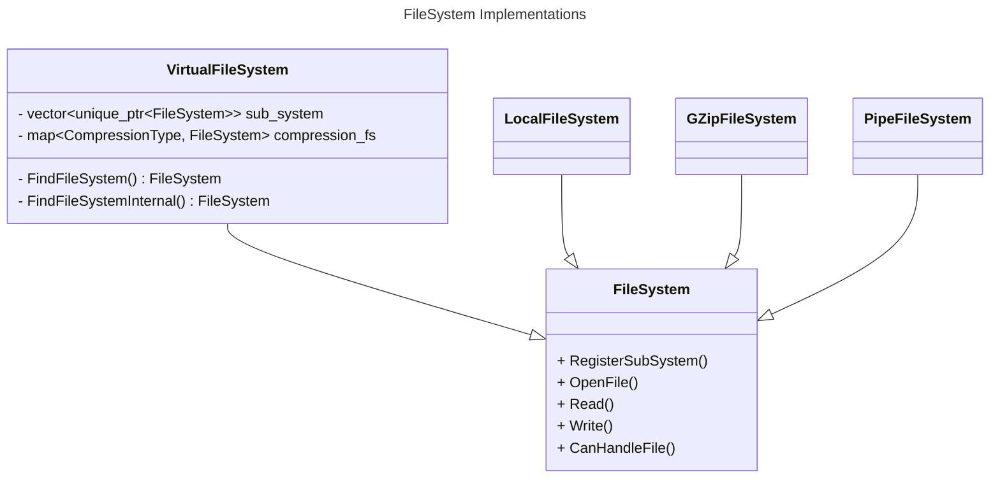
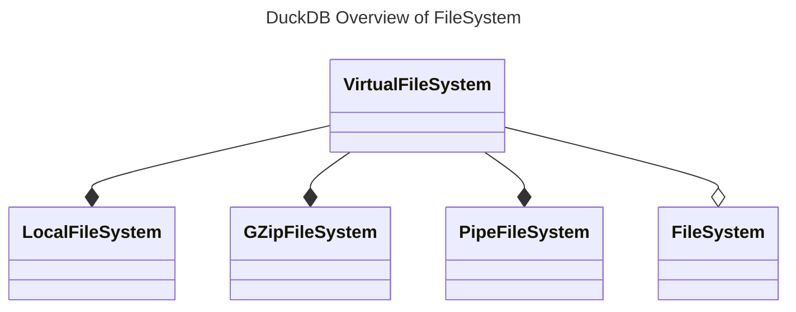

# File System

This file describes how the IO works in DuckDB. When we say IO we mean for file read and write specifically. 

## Overview

The DuckDB file handling can seem very complex to begin with. But what they actually do is just to wrap specific file system in one huge file system. To be Specific, DuckDB has created a super type called `FileSystem` which every file system in DuckDB inherits from(See class diagram "FileSystem Implementations" below). DuckDB decides which specific type of `FileSystem` to use by using `VirtualFileSystem` as a dispatcher. By calling `VirtualFileSystem::OpenFile()` it provides a `FileHandler` which can be used in the subsequent calls to `VirtualFileSystem::Read()` and `VirtualFileSystem:Write()`.

The `VirtualFileSystem` class contains two fields called `compression_fs`, which contains a map of compression mechanism mapped to a FileSystem, and `sub_systems` is a list of classes of type `FileSystem`. 

As can be seen in the graph below, the `VirtualFileSystem` composes the different types of `FileSystem`.

The `LocalFileSystem` is the default file system, that the `VirtualFileSystem` uses when nothing else can be found in `VirtualFileSystem::FindFileSystem()` is called.

### Where is the `VirtualFileSystem` initialized

In the `Database.cpp` an instance of the `VirtualFileSystem` class is initialized. 

> [!IMPORTANT] 
> There is a possibility to inject another file system into the database. Look at line 408-409 in `Database.cpp`. An example of extending the file system is by looking at httpfs

## LocalFileSystem

The class `LocalFileSystem` is a simple file/directory system handler that can read and write to files with and without a specific range of bytes.

It uses the OS file system to interact with the disk. That is, the IO path goes through the virtual file system abstraction layer and does not bypass it in order to go directly to the device.