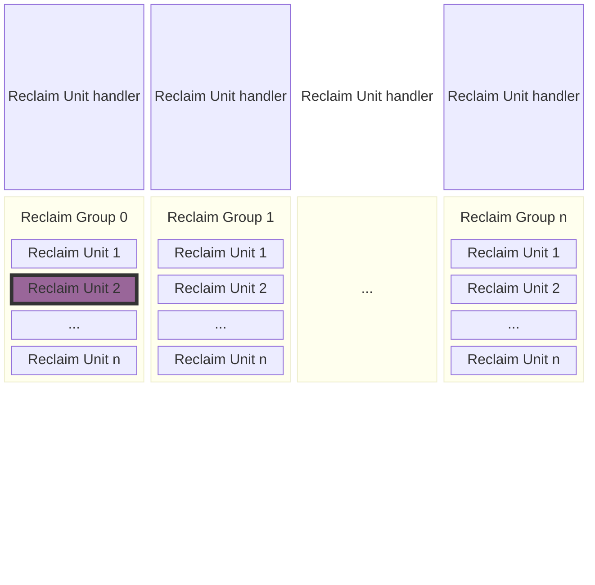
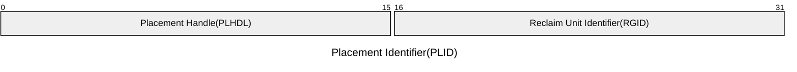

# Introduction to FDP

```mermaid
block-beta
columns 4
    A["Reclaim Unit handler"]:1
    B["Reclaim Unit handler"]:1
    C["Reclaim Unit handler"]:1
    D["Reclaim Unit handler"]:1
    
    block:RG0
        columns 1
        uct1("Reclaim Group 0")
        A1["Reclaim Unit 1"]
        B1["Reclaim Unit 2"]
        C1["..."]
        D1["Reclaim Unit n"]
    end
    block:RG1
        columns 1
        uct2("Reclaim Group 1")
        A2["Reclaim Unit 1"]
        B2["Reclaim Unit 2"]
        C2["..."]
        D2["Reclaim Unit n"]
    end
    block:RGb
        columns 1
        uct3("...")
    end
    block:RGn
        columns 1
        uct4("Reclaim Group n")
        A4["Reclaim Unit 1"]
        B4["Reclaim Unit 2"]
        C4["..."]
        D4["Reclaim Unit n"]
    end
    space

  class uct1,uct2,uct3,uct4,C!,C2,C4,RGb,RUH BT
  classDef BT stroke:transparent,fill:transparent
  style B1 fill:#969,stroke:#333,stroke-width:4px

```

```mermaid
---
title: "Placement Identifier(PLID)"
---
packet-beta
0-15: "Placement Handle(PLHDL)"
16-31: "Reclaim Unit Identifier(RGID)"
```
