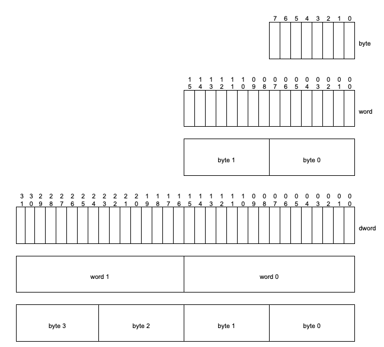

# IO_URING Flexible Data Placement(FDP)

This file is going to describe how to write and read data directly from the device. There are many things that goes into this. Some of the things is the placement of data and how to know where they are placed. 

The question that we are trying to answer here is:

- How do we get information about the logical block address?
  - Is the logical block address space individual for each Reclaim Unit Handle?
  - Do we even have to use logical block addresses or is this just a construct to make it easy to handle data?

- At startup
  - How do we know at which offset to start from?
  - How do we know at startup what is placed where?

We are also trying to provide some examples on how to get this information.

## Type specification

Here we specify some of the common data types used. This is not in terms of structs, but in terms of what a word and dword is:



As can be seen on the picture above:

| Name  | Size                          |
| ----- | ----------------------------- |
| Byte  | 8 bits                        | <!-- Common knowledge... --> |
| Word  | 2*Byte (16 bits)              |
| DWord | 2 * Word(4 * Byte or 32 bits) |


### Placement Identifier

> *Placement Handle* is a namespace scoped handle that maps to an Endurance Group scoped Reclaim Unit Handle which references a Reclaim Unit in each Reclaim Group
>
> *NVM Express Base Specification Revision 2.1, page 12*

> *Placement Identifier* is a data structure that specifies a Reclaim Group Identifier and a Placement Handle that references a reclaim unit. 
>
> *NVM Express Base Specification Revision 2.1, page 12*

> [!NOTE]
> Placement Identifier data structure is described on page 274 in the Base Specification of the NVMe spec

The placement identifier can be of two types:

- Placement Identifier without Reclaim Group Identifier(RGID)
  - It is just the first 16 bits(0 to 15 in the spec) that specifies the Placement Handle(PHNDL)
- Placement Identifier with a non-zero RGIF
  - The first 16 bits is for the PHNDL and then the next 3 is for the RGID


## Get to know your device

### IO Management Receive command

> [!NOTE]
> The IO Management Receive command is documented in the NVMe FDP specification in (section 3.1, page 62). There is also a specification about it in section 7, page 47-52 

> *This command is used in order to receive information from the controller used by the host to manage I/O*
>
> *- TP4148 Flexible Data Placement, section 7.TBD_IOMR, page 48*

There is a list of Operation Codes (OPCode). Specifically the operations codes for IO Management is(Not all opcodes are specified here, only those relevant to the IO management commands):

| Command name          | Opcode (bits) | Opcode (Hex) |
| --------------------- | ------------- | ------------ |
| IO Management Send    | 0001 1101b    | 1Dh          |
| IO Management Receive | 0001 0001b    | 12h          |

> - `b` = bits
> - `h` = hex
>
> This is also used in the specification.

The `CacheLib` implementation actually has this constructed as an enum:

```c++
enum nvme_io_opcode {
  nvme_cmd_write = 0x01,
  nvme_cmd_read = 0x02,
  nvme_cmd_io_mgmt_recv = 0x12,
  nvme_cmd_io_mgmt_send = 0x1d,
};
```

In the specification the do not describe what the *IO Management Send* Opcode is used for or what it does. Only the *IO Management Receive* Command is described. So from now on that is what we focus on. The Send command is not used in the `CacheLib` implementation either. 

#### Send the Receive request

In order to send the IO Management Receive request we need to use `ioctl`. `ioctl` is a tool that can be used to manage devices. For that reason when `ioctl` is being called we need to get and use the file descriptor of the device file(e.g. `/dev/ng0n0`). 

Calling `ioctl`, the specification has specified a data structure that needs to be provided:

```c++
struct nvme_passthru_cmd cmd = {
      .opcode = 0x12,
      .nsid = nsid,
      .addr = (uint64_t)(uintptr_t)data, // Data to be return from the command
      .data_len = data_len, // Length of the data
      .cdw10 = cdw10,  // This field specifies the management operation
      .cdw11 = cdw11, // Specifies the number of dwords to transfer it is 0 indexed
      .timeout_ms = 0,
  };
```

- Dword 10: Specifies the management operation (To get Reclaim Unit Handle status, the value is `01h`) 
  - There is more to this field which you can read on page 49. At the time of reading the document there is only one value for `Dword 10 `.
- DWord 11 (NUMD): Is the number of `Dword` to transfer. My interpretation is that it is the number of status handles. The value is zero indexed.
  
> [!IMPORTANT]
> `CacheLib` calculates `Dword11` by saying `data_len >> 2 - 1`(i.e. it divides data_len by 4 and then subtract 1 to account for 0 indexed values). The reason why they do that is to break the `data_len` into number of `DWORD`'s. Since `>> 2` is like dividing with 4 then it is because we want it to be divded in the size of a `DWORD` which is 4 bytes.

We send the command to `ioctl` like the following:

```c++
ioctl(file_.fd(), NVME_IOCTL_IO_CMD, &cmd);
```

> [!NOTE]
> The `NVME_IOCTL_IO_CMD` and the `nvme_passthru_cmd` struct is defined in the [`linux/nvme_ioctl.h`](https://github.com/torvalds/linux/blob/master/include/uapi/linux/nvme_ioctl.h) file


## Writing to the device

In FDP specification on page 61, it is described that the two fields needs to be declared in order to tell the device that you use FDP and which Reclaim Group Handler to use. 

- `DTYPE` needs to be set to `02h` to signal that we use FDP.
- When `DTYPE` is specified then we set `DSPEC` to the placement handle identifier that we need to use.

> [!NOTE]
> The Placement Handle Identifier(PHID) is a combination of a Reclaim Group Id and a Reclaim Group Handler id. We should get this information from the device(IO Management Receive)